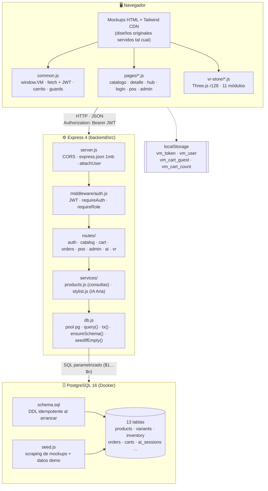
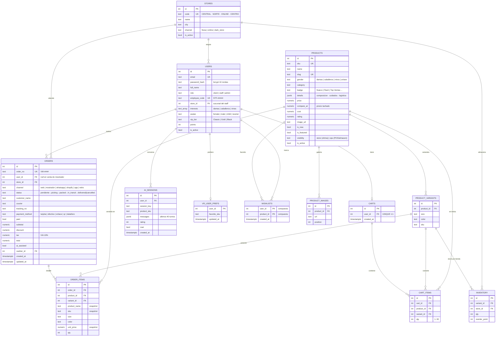
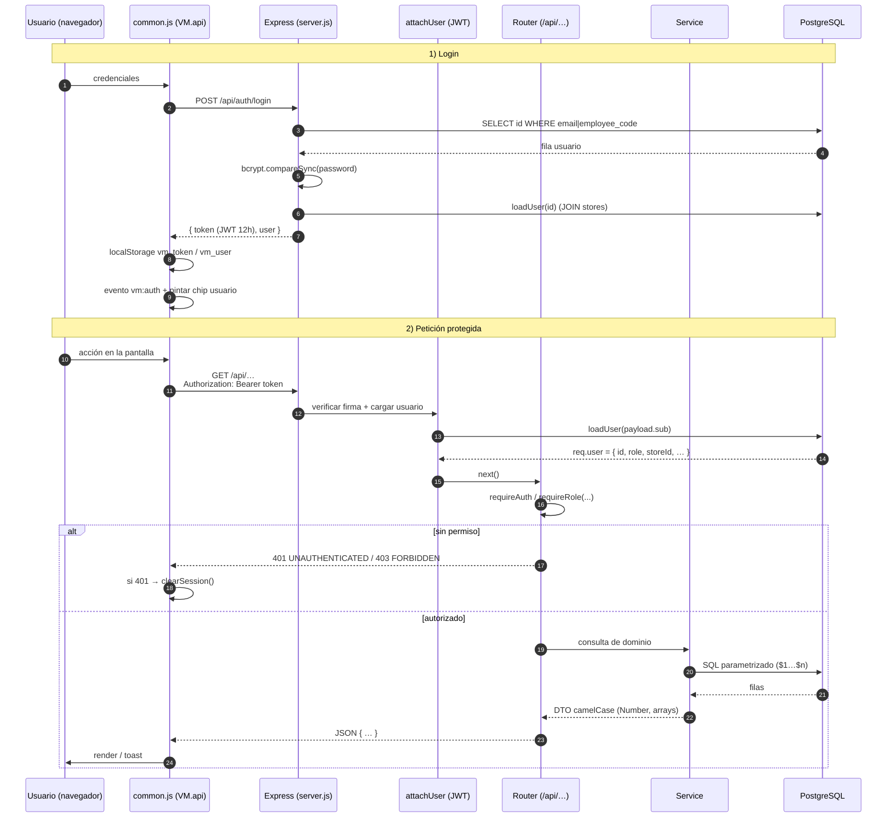
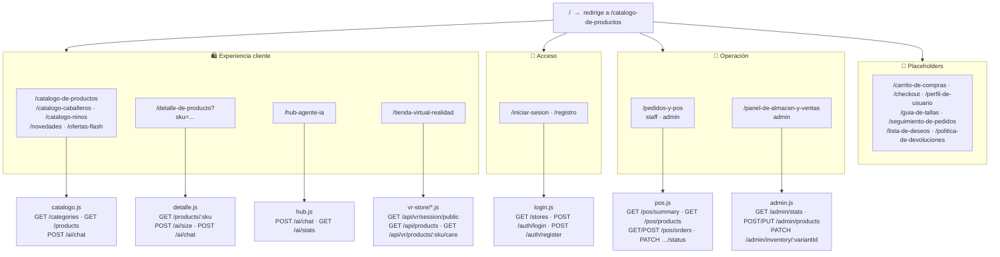
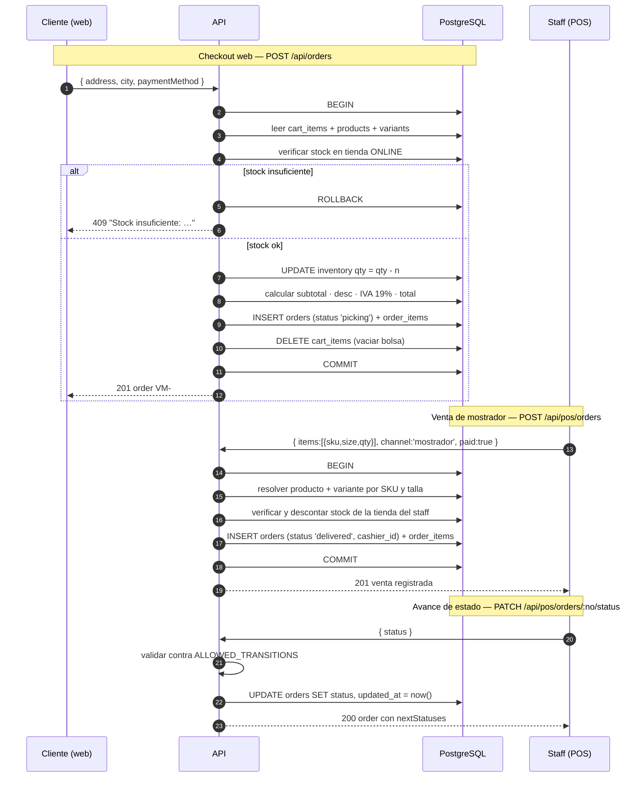
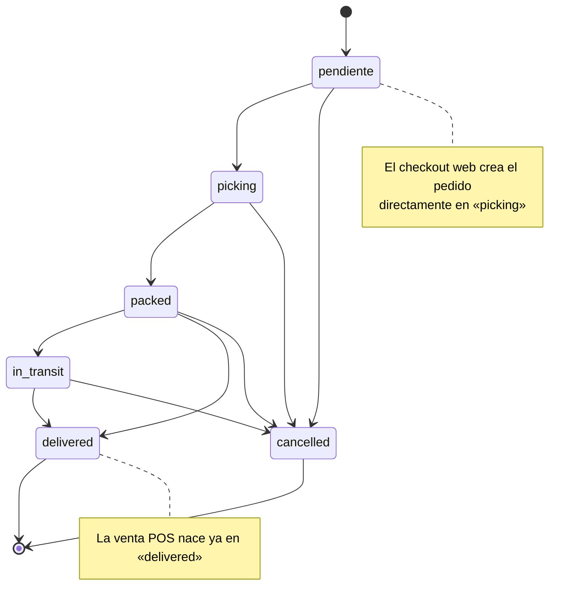
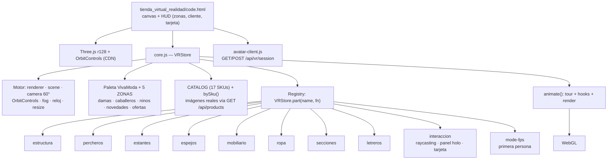

# 🏗️ Arquitectura y Modelo de Datos — VivaModa

> Diagramas en **Mermaid** (se renderizan en GitHub/GitLab/VS Code con extensión Markdown Preview Mermaid).
> Contexto del proyecto: [`docs/REPORTE.md`](./REPORTE.md)

## Índice

1. [Arquitectura del sistema](#1-arquitectura-del-sistema)
2. [Modelo de datos (ER)](#2-modelo-de-datos-er)
3. [Capas del backend](#3-capas-del-backend)
4. [Flujo de una petición autenticada](#4-flujo-de-una-petición-autenticada)
5. [Mapa de rutas y módulos del frontend](#5-mapa-de-rutas-y-módulos-del-frontend)
6. [Flujo de un pedido (checkout y POS)](#6-flujo-de-un-pedido-checkout-y-pos)
7. [Módulo VR (registro de partes)](#7-módulo-vr-registro-de-partes)

---

## 1. Arquitectura del sistema



**Lectura del diagrama**

- El backend es **API-first pero también sirve los mockups**: `sendPage()` inyecta `common.js` + el script de la página antes de `</body>`, por lo que no hay duplicación de HTML.
- Toda petición pasa por `attachUser` (autenticación **opcional**) y cada router endurece el acceso con `requireAuth` / `requireRole`.
- El acceso a datos está aislado en `db.js` (pool de 10 conexiones, `tx()` para transacciones, `ensureSchema()` + `seedIfEmpty()` en el arranque).
- El estado de sesión vive en `localStorage`; el servidor es *stateless* (solo JWT).

---

## 2. Modelo de datos (ER)



### Relaciones en texto (referencia rápida)

| Origen | Cardinalidad | Destino | Semántica |
|---|---|---|---|
| `stores` | 1 → N | `users` | Tienda asignada al staff |
| `stores` | 1 → N | `inventory` | Stock por sucursal |
| `stores` | 1 → N | `orders` | Pedidos despachados por tienda/canal |
| `users` | 1 → 0..1 | `carts` | Carrito persistente (1 por usuario) |
| `users` | 1 → N | `orders` | Pedidos del cliente (`user_id` NULL en POS) |
| `users` | 1 → N | `orders` (cashier) | Cajero que registró la venta |
| `users` | 1 → N | `ai_sessions` | Conversaciones con Aria |
| `users` | 1 → 0..1 | `vr_user_prefs` | Producto destacado en VR |
| `products` | 1 → N | `product_images` / `product_variants` | Galería y talla×color |
| `product_variants` | 1 → N | `inventory` | Stock por variante y tienda |
| `products` | 1 → N | `order_items` / `cart_items` / `wishlists` | Economía del producto |
| `orders` | 1 → N | `order_items` | Líneas del pedido |
| `carts` | 1 → N | `cart_items` | Líneas de la bolsa |

### Constraints e integridad

| Constraint | Tabla | Detalle |
|---|---|---|
| `UNIQUE` | `users` | `email`, `employee_code` |
| `CHECK` | `users.role` | `client · staff · admin` |
| `UNIQUE` | `products` | `sku`, `slug` |
| `CHECK` | `products.gender` / `products.visibility` | Enumeraciones controladas |
| `UNIQUE` | `product_variants` | `(product_id, size, color)` |
| `UNIQUE` | `inventory` | `(variant_id, store_id)` |
| `UNIQUE` | `carts` | `user_id` (1:1) |
| `UNIQUE` | `cart_items` | `(cart_id, product_id, variant_id)` |
| `PRIMARY KEY` compuesta | `wishlists` | `(user_id, product_id)` |
| `PRIMARY KEY` | `vr_user_prefs` | `user_id` |
| `ON DELETE CASCADE` | Imágenes, variantes, inventario, ítems, carrito | Limpieza en cascada |
| `ON DELETE SET NULL` | `orders.user_id`, `orders.cashier_id`, `ai_sessions.user_id` | Preserva histórico |

### Índices

```sql
idx_products_gender · idx_products_category · idx_products_active
idx_variants_product · idx_inventory_variant · idx_inventory_store
idx_orders_status · idx_orders_store · idx_orders_user · idx_order_items_order
```

---

## 3. Capas del backend

```mermaid
flowchart LR
    subgraph HTTP["Capa HTTP"]
        S["server.js<br/>CORS · json · attachUser<br/>rutas amigables + inyección de scripts"]
    end

    subgraph AUTH["Capa de seguridad"]
        M["middleware/auth.js<br/>signToken · loadUser<br/>requireAuth · requireRole"]
    end

    subgraph R["Capa de controladores (routes/)"]
        direction TB
        RA["auth.js<br/>registro · login · perfil"]
        RC["catalog.js<br/>productos · categorías · tiendas"]
        RT["cart.js<br/>carrito del cliente"]
        RO["orders.js<br/>checkout · mis pedidos"]
        RP["pos.js<br/>mostrador · kanban · estados"]
        RD["admin.js<br/>KPIs · CRUD · inventario"]
        RI["ai.js<br/>chat · tallas · métricas"]
        RV["vr.js<br/>sesión · destacados · cuidado"]
    end

    subgraph SV["Capa de dominio (services/)"]
        SP["products.js<br/>listProducts · getProductDetail<br/>getVariantsWithStock · toLight"]
        SS["stylist.js<br/>extractIntent · recommendForIntent<br/>recommendSize · stylistReply"]
    end

    subgraph DL["Capa de datos"]
        D["db.js<br/>pool(10) · query() · tx()<br/>ensureSchema() · money()"]
        DB[("PostgreSQL 16")]
    end

    HTTP --> AUTH --> R --> SV --> DL
    D --> DB
```



**Regla de dependencias:** las rutas nunca escriben SQL complejo de negocio; delegan en `services/`. Las mutaciones críticas (checkout, venta POS, ajuste de inventario) usan `tx()` con `BEGIN/COMMIT/ROLLBACK`.

---

## 4. Flujo de una petición autenticada



---

## 5. Mapa de rutas y módulos del frontend



---

## 6. Flujo de un pedido (checkout y POS)



**Máquina de estados del pedido**



---

## 7. Módulo VR (registro de partes)



**Contrato del registry**

```js
VRStore.part('nombre', (S, group) => { /* construir malla en `group` */ });
VRStore.addClickable(mesh);          // objetos seleccionables (raycasting)
VRStore.addAnimate((dt, t) => {});   // hook por fotograma
VRStore.init();                      // construye partes + arranca el bucle
```

---

## 8. Referencias cruzadas

| Tema | Archivo |
|---|---|
| Reporte narrativo completo | [`docs/REPORTE.md`](./REPORTE.md) |
| DDL de la base de datos | `backend/src/schema.sql` |
| Arranque, rutas amigables e inyección de scripts | `backend/src/server.js` |
| Autenticación y roles | `backend/src/middleware/auth.js` |
| Consultas de catálogo e inventario | `backend/src/services/products.js` |
| Motor de IA "Aria" | `backend/src/services/stylist.js` |
| Semilla demo (scraping + datos) | `backend/src/seed.js` |
| Helpers del cliente | `backend/public/js/common.js` |
| Motor y partes de la tienda VR | `backend/public/js/pages/vr-store/` |
