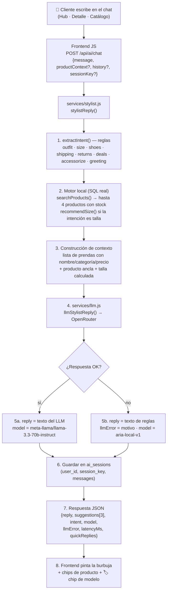

# 🤖 IA Estilista "Aria" — Integración LLM y estructura del proyecto

> Documento técnico de la integración de IA realizada y de cómo está organizado
> el proyecto VivaModa a partir de ella.
>
> Complementos: [`SESION-IA-OPENROUTER.md`](./SESION-IA-OPENROUTER.md) (continuidad de
> sesión) · [`REPORTE.md`](./REPORTE.md) (reporte general) · [`ARQUITECTURA.md`](./ARQUITECTURA.md) (diagramas)

---

## Parte A — La integración de IA

### A.1 Resumen

| Aspecto | Valor |
|---------|-------|
| Proveedor | **OpenRouter** (`https://openrouter.ai/api/v1/chat/completions`) — API compatible con OpenAI |
| Modelo activo | `meta-llama/llama-3.3-70b-instruct` |
| Configuración | `backend/.env` → `OPENROUTER_API_KEY` + `OPENROUTER_MODEL` (también acepta `OPENAI_API_KEY`) |
| Fallback | Motor local de reglas (`stylist.js`) si el LLM falla; forzable con `USE_LOCAL_AI=true` |
| Contexto | El motor local busca productos reales por SQL y se los pasa al LLM → **nunca inventa prendas** |
| Idioma | Español, tono fashion-editorial, precios en COP |
| Persistencia | Cada conversación se guarda en la tabla `ai_sessions` (PostgreSQL) |
| UI | Chip de modelo bajo cada burbuja del asistente + estado del motor en el Hub |

### A.2 Flujo de una conversación



**Puntos clave del diseño:**

1. **El motor local nunca desaparece:** aunque haya LLM, él decide *qué productos*
   se muestran (`suggestions`) y calcula tallas de forma determinística. El LLM solo
   genera el *texto conversacional*. Si OpenRouter cae, la tienda sigue operando.
2. **Anti-alucinación:** el prompt del sistema prohíbe inventar productos y el único
   catálogo que el modelo ve es el que el backend le pasa (SQL con stock real).
3. **La calculadora de tallas manda sobre el LLM:** si la intención es `size`, la talla
   se calcula en local y se inyecta en el contexto (`sizeHint`), así el LLM no "opina".

### A.3 Archivos de la integración

| Archivo | Rol |
|---------|-----|
| `backend/src/services/llm.js` **(nuevo)** | Cliente OpenRouter: `llmAvailable()`, `llmStatus()` (ping con caché en la ruta), `llmStylistReply(ctx)`. Prompt de sistema de Aria, reintentos x2 con backoff, timeout 60 s, parseo tolerante |
| `backend/src/services/stylist.js` **(modificado)** | Orquestador: intención → SQL → contexto → LLM → fallback. Devuelve `model` y `llmError` |
| `backend/src/config.js` **(modificado)** | `openrouterApiKey`, `openrouterModel`, `useLocalAi` |
| `backend/src/routes/ai.js` **(modificado)** | `/api/ai/chat` guarda sesiones; `/api/ai/stats` expone `engine` (estado LLM con caché 60 s) |
| `backend/.env` **(modificado)** | Clave + modelo de OpenRouter |
| `backend/public/js/common.js` **(modificado)** | `modelShortName()` y `modelChipHtml()` (exportados en `window.VM`) |
| `backend/public/js/pages/{hub,detalle,catalogo}.js` **(modificados)** | Renderizan el chip del modelo en cada burbuja del asistente |
| `frontends/hub-agentes-ia/code.html` | Mockup intacto — el encabezado "Modo Inferencia Viva" es reescrito en vivo por `hub.js` |

### A.4 El indicador de modelo en la UI

**En cada burbuja del asistente** (Hub, Detalle y Catálogo) aparece un chip:

- 🟢 `auto_awesome` **"Llama · OpenRouter"** — la respuesta la generó el LLM real
  (tooltip: `Respuesta generada por meta-llama/llama-3.3-70b-instruct vía OpenRouter`).
- ⚪ `settings_suggest` **"Motor local"** — OpenRouter falló o no hay clave; respondió
  el motor de reglas (tooltip incluye el motivo del fallback).

**En el encabezado del Playground del Hub** (`/hub-agente-ia`), la etiqueta
"Modo Inferencia Viva" es reemplazada en vivo por:

- 🟢 `Motor: llama-3.3-70b-instruct · OpenRouter` (punto verde)
- 🟠 `Motor: Motor local` (punto ámbar) — con tooltip del motivo

Fuente de verdad: `GET /api/ai/stats → engine` (con caché de 60 s para no
saturar OpenRouter con pings).

### A.5 Ejemplo real de respuesta de la API

```json
{
  "reply": "Para una boda de gala, te recomiendo el **Vestido Asimétrico Magenta Atelier**...",
  "suggestions": [
    { "sku": "VM-DAM-ATELIER", "name": "Vestido Asimétrico Magenta Atelier", "price": 189900, "...": "..." },
    { "sku": "VM-DAM-8813", "name": "Blazer Cropped Smoking Noir", "price": 129900 }
  ],
  "intent": "outfit",
  "model": "meta-llama/llama-3.3-70b-instruct",
  "llmError": null,
  "latencyMs": 9895,
  "quickReplies": ["¿Qué zapatos le van mejor?", "¿Cuál es mi talla para 1.68m?", "…"],
  "sessionKey": "web-3f2a1b4c"
}
```

### A.6 Variables de entorno (bloque IA de `backend/.env`)

```env
OPENROUTER_API_KEY=sk-or-v1-…
OPENROUTER_MODEL=meta-llama/llama-3.3-70b-instruct
# USE_LOCAL_AI=true   ← fuerza el motor de reglas aunque haya API key
```

---

## Parte B — Estructura del proyecto (post-integración)

### B.1 Mapa general

```
vivamoda/
├── README.md                          Documentación principal (stack, API, credenciales)
├── docs/
│   ├── REPORTE.md                     Reporte general del proyecto
│   ├── ARQUITECTURA.md                Diagramas Mermaid (sistema, ER, capas, rutas)
│   ├── IA-ESTILISTA.md                ← ESTE DOCUMENTO (IA + estructura)
│   └── SESION-IA-OPENROUTER.md        Continuidad de sesión (qué falta por hacer)
│
├── backend/                           ← TODO el código de servidor y wiring
│   ├── package.json                   express · pg · bcryptjs · jsonwebtoken · cors · dotenv
│   ├── docker-compose.yml             PostgreSQL 16-alpine :5432 (vol. vivamoda_pgdata)
│   ├── .env / .env.example            PORT · DATABASE_URL · JWT_SECRET · OPENROUTER_*
│   │
│   ├── src/
│   │   ├── server.js                  Express: API + sirve los mockups + inyecta js/
│   │   ├── config.js                  Env: puerto, DB, JWT, OPENROUTER_*, USE_LOCAL_AI
│   │   ├── db.js                      Pool pg · query() · tx() · ensureSchema() · waitForDb()
│   │   ├── schema.sql                 DDL (13 tablas: users, stores, products, variants,
│   │   │                              inventory, carts, cart_items, orders, order_items,
│   │   │                              wishlists, ai_sessions, …)
│   │   ├── seed.js                    Semilla: scrapea los code.html → productos demo
│   │   │
│   │   ├── middleware/auth.js         JWT + roles (client · staff · admin)
│   │   │
│   │   ├── routes/                    8 routers montados en server.js
│   │   │   ├── auth.js                /api/auth (registro, login, me)
│   │   │   ├── catalog.js             /api/products, /api/categories
│   │   │   ├── cart.js                /api/cart (+items)
│   │   │   ├── orders.js              /api/orders (web cliente)
│   │   │   ├── pos.js                 /api/pos (kanban, venta mostrador)
│   │   │   ├── admin.js               /api/admin (KPIs, CRUD productos, inventario)
│   │   │   ├── ai.js                  /api/ai (chat · size · stats ← engine state)
│   │   │   └── vr.js                  /api/vr (payload para la tienda 3D)
│   │   │
│   │   └── services/
│   │       ├── products.js            Consultas de catálogo reutilizables
│   │       ├── stylist.js             IA "Aria": intención + SQL + calculadora de tallas
│   │       │                          + orquestación del LLM y fallback
│   │       └── llm.js                 ★ NUEVO: cliente OpenRouter (prompt Aria,
│   │                                  reintentos, llmStatus para métricas)
│   │
│   ├── public/js/                     Wiring que se inyecta en los mockups servidos
│   │   ├── common.js                  window.VM: api() · sesión · carrito · toast
│   │   │                              · modelShortName() · modelChipHtml() ★
│   │   └── pages/
│   │       ├── catalogo.js            Catálogo vivo + chat flotante + chip modelo ★
│   │       ├── detalle.js             Detalle + estilista + chip modelo ★
│   │       ├── hub.js                 Hub IA + estado de motor en encabezado ★
│   │       ├── login.js               Login/registro
│   │       ├── pos.js                 Consola POS
│   │       ├── admin.js               Panel almacén
│   │       └── vr-store/              Tienda 3D (Three.js r128, 11 módulos)
│   │
│   ├── cdp-indicator-test.mjs         ☆ Script QA temporal (Chrome DevTools Protocol)
│   ├── hub_chat_prueba.png            📸 Evidencia: chat E2E del Hub
│   ├── hub_modelo_indicador.png       📸 Evidencia: chip de modelo en el Hub
│   └── server.log                     Log de la última ejecución
│
├── frontends/                         Páginas HTML servidas por la API
│   ├── tienda-catalogo/               Mockup → /catalogo-de-productos
│   ├── detalle-producto-ia/           Mockup → /detalle-de-producto?sku=…
│   ├── hub-agentes-ia/                Mockup → /hub-agente-ia
│   ├── portal-acceso/                 Mockup → /iniciar-sesion · /registro
│   ├── pos-pedidos/                   Mockup → /pedidos-y-pos
│   ├── panel-almacen/                 Mockup → /panel-de-almacen-y-ventas
│   └── tienda-vr/                     Pantalla 3D → /tienda-virtual-realidad
└── assets/
    └── sistema-diseno/                DESIGN.md (tokens del sistema de diseño)
```

★ = creado/modificado en la sesión de integración IA · ☆ = temporal (decidir si se conserva)

### B.2 Cómo funcionan las piezas juntas

1. **server.js** sirve cada mockup `code.html` en su ruta amigable y **inyecta antes
   de `</body>`** los scripts `/js/common.js` + `/js/pages/<página>.js`. Los diseños
   originales no se tocan; el JS "wiring" reemplaza los datos mock por llamadas a la API.
2. **common.js** expone `window.VM` (fetch con JWT, carrito invitado, toasts, rutas y
   ahora los helpers del indicador de modelo).
3. **Los routers Express** consumen los services; los services hablan con PostgreSQL
   vía el pool de `db.js` (esquema auto-aplicado y auto-sembrado al primer arranque).
4. **La IA** vive entre `routes/ai.js` → `services/stylist.js` (orquestador) →
   `services/llm.js` (OpenRouter), con el catálogo real de Postgres como fuente de verdad.

### B.3 Endpoints del módulo IA

| Método y ruta | Auth | Qué hace |
|---------------|------|----------|
| `POST /api/ai/chat` | pública | Chat del estilista. Body: `{ message, productContext?, history?, sessionKey? }`. Devuelve `{ reply, suggestions[], intent, model, llmError, latencyMs, quickReplies, sessionKey }` |
| `POST /api/ai/size` | pública | Calculadora biométrica de tallas (determinística, sin LLM). Body: `{ height, weight?, bust?, hips? }` |
| `GET /api/ai/stats` | pública | Métricas del Hub + **`engine`** (estado OpenRouter/local, modelo, latencia del ping) |

### B.4 Pantallas con chat IA + indicador

| Ruta | Interfaz | Chip de modelo |
|------|----------|----------------|
| `/hub-agente-ia` | Playground del Hub (form `#chat-form`) | ✅ en burbujas + estado del motor en encabezado |
| `/detalle-de-producto?sku=…` | Asistente lateral del producto | ✅ bajo cada respuesta |
| `/catalogo-de-productos` | Chat flotante de la tienda | ✅ bajo cada respuesta |

### B.5 Comandos de operación

```bash
cd backend

npm run db:up      # PostgreSQL en Docker
npm start          # API + frontends en http://localhost:3000
npm run dev        # igual, con recarga automática (--watch)

# Estado rápido
curl http://localhost:3000/api/health
curl -s http://localhost:3000/api/ai/stats | node -e "let d='';process.stdin.on('data',c=>d+=c).on('end',()=>console.log(JSON.stringify(JSON.parse(d).engine,null,2)))"

# Probar el chat (LLM real)
curl -X POST http://localhost:3000/api/ai/chat -H "Content-Type: application/json" \
  -d '{"message":"Necesito un vestido para una boda de gala"}'

# Verificar sintaxis tras editar
node --check src/services/llm.js && node --check public/js/common.js
```

### B.6 Cambiar de modelo o volver al motor local

```env
# En backend/.env — solo cambia esta línea (y reinicia npm start):
OPENROUTER_MODEL=google/gemini-2.0-flash-001     # más rápido
OPENROUTER_MODEL=openai/gpt-4o-mini              # alternativo
OPENROUTER_MODEL=meta-llama/llama-3.3-70b-instruct  # actual

# O fuerza el motor local (sin costo, sin red):
USE_LOCAL_AI=true
```
